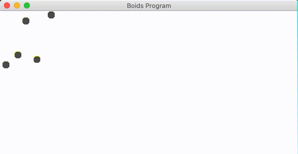

# Drone Simulator GUI.
This is my attempt at a GUI for a my Drone Simulator. Starting again in regards to design but using old Drone Simulator project as reference.

After some research, I've decided to create my Drone Simulation with the inspiration of boids. I will be implementing three rules to emulate 'flocking' which is a behaviour of which boids are famous for. So far, I've discovered three rules: Cohesion, Alignment, Separation - I'm hoping these get me closer to my goal of a drone simulator. 

I'm hoping to eventually progress and create 'Predator drones' which will be bigger and will cause normal drones to 'scatter' when encountering this particular type of drone.

## Trial 1

